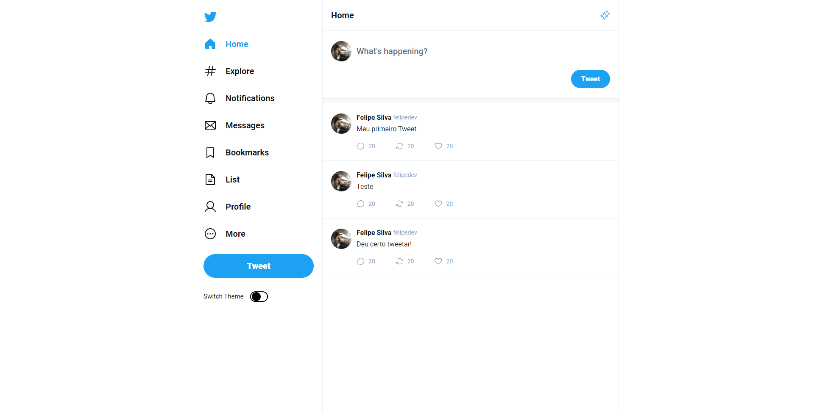
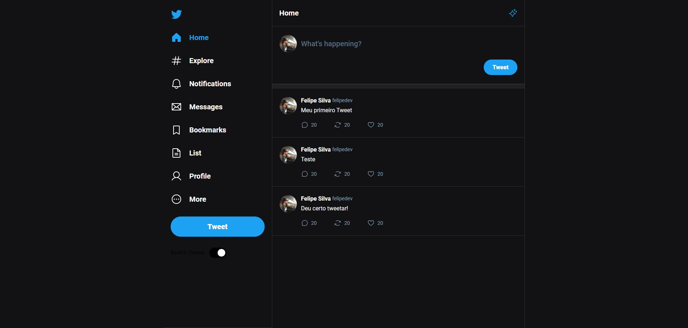

<h1 align="center"> Twitter UI </h1>

  <a href="#-tecnologias">Tecnologias</a>&nbsp;&nbsp;&nbsp;|&nbsp;&nbsp;&nbsp;
  <a href="#-projeto">Projeto</a>&nbsp;&nbsp;&nbsp;|&nbsp;&nbsp;&nbsp;
  <a href="#memo-licença">Licença</a>

## Screen Light

  

## Dark Screen

  

 

## 🚀 Tecnologias

Esse projeto foi desenvolvido com as seguintes tecnologias:

- ReactJS
- CSS PURO
- React Router Dom
- Context

## 💻 Projeto

UI da Página do Twitter feito no masterclass de React da Rocketseat, coloquei a funcionalidade de mudar o thema como um bônus

## :memo: Licença

Esse projeto está sob a licença MIT.

---
